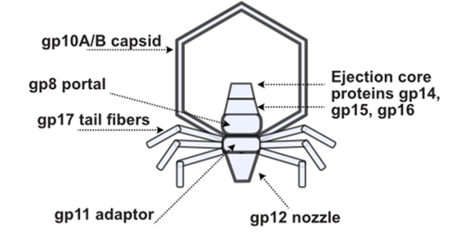

# My Data Science Projects

Welcome to my project portfolio! Below you'll find a selection of my work in data science, biochemistry, and chemical engineering, demonstrating a range of analytical and problem-solving skills. Click on any project to learn more.

---

-   __Phage DMS: Mapping Viral Fitness Landscapes__
    ---
    { width="150" } <!-- Choose a representative thumbnail -->
    A deep dive into how genetic variations in bacteriophage T7 affect its ability to infect different bacterial hosts, utilizing Deep Mutational Scanning (DMS) and advanced data analysis.
    [:octicons-arrow-right-24: View Project Details](phage_dms.md)

-   __STRAP: Solvent-Targeted Plastic Recycling__
    ---
    Optimized a Solvent-Targeted Recovery and Precipitation (STRAP) process for recycling multilayer plastic films, achieving high polymer yields and developing methods for solvent reuse.
    [View Project Details](strap_recycling.md) :octicons-arrow-right-24:

