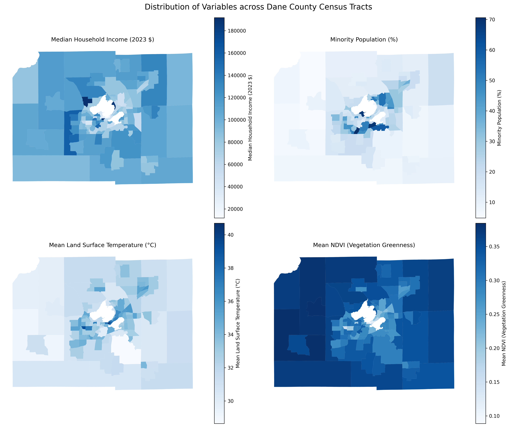
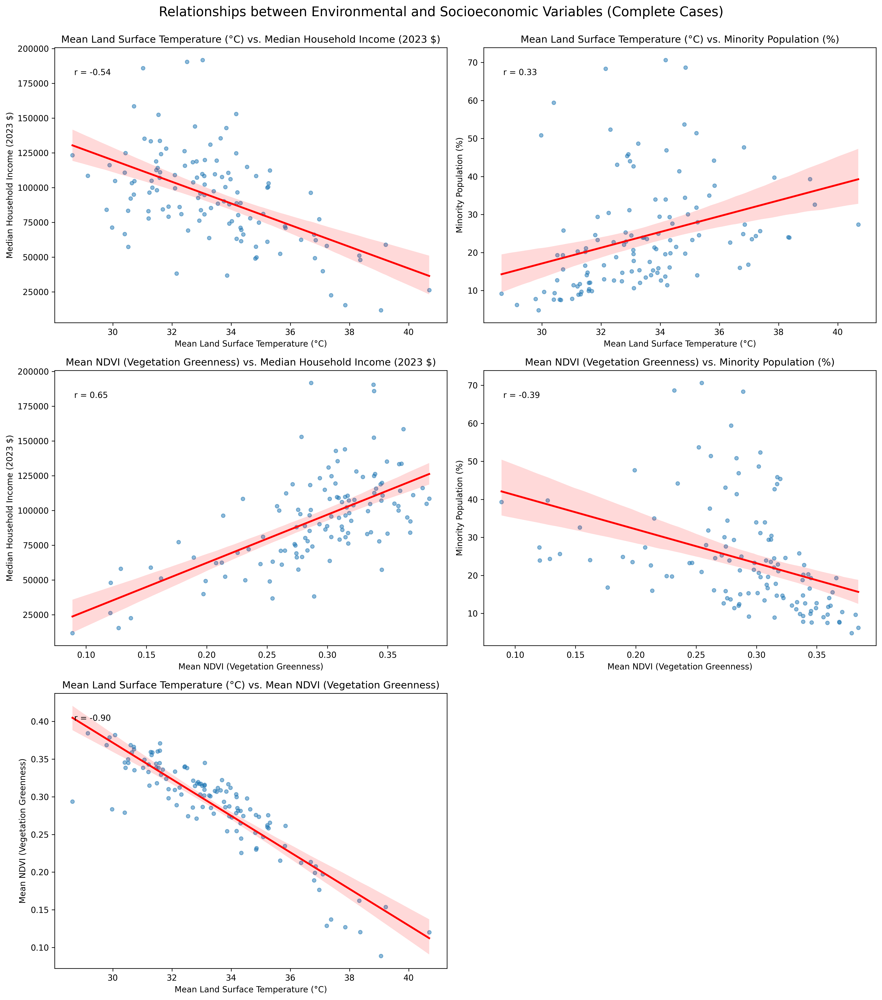
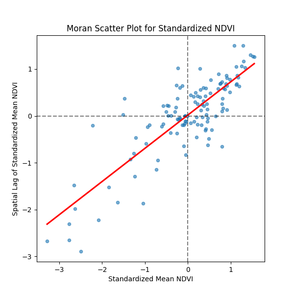

# Thermal Inequity Landscapes: A Dane County Analysis {: #thermal-inequity-landscapes-a-dane-county-analysis .text-center data-aos="fade-down" }
<!-- NOTE: The ID will be auto-generated from this H1 title. Ensure your CSS uses this ID if targeting this page specifically. -->

**Collaboration:** Mihir Heda  
{: .text-center data-aos="fade-down" data-aos-delay="100"}

**Period:** Spring 2025  
{: .text-center data-aos="fade-down" data-aos-delay="200"}

**Context:** Advanced Geocomputing Final Project  
{: .text-center data-aos="fade-down" data-aos-delay="300"}

## Project Goal & Motivation {: .text-center}
Urban areas often experience elevated temperatures, a phenomenon known as the Urban Heat Island (UHI) effect, which can significantly impact public health and quality of life. Green spaces, rich in vegetation, play a crucial role in mitigating these heat effects through shading and evapotranspiration. This project investigated whether the cooling benefits of green spaces and the burden of excess heat are evenly distributed across different socioeconomic and racial groups within Dane County, Wisconsin. We aimed to uncover potential environmental inequities by exploring correlations between Land Surface Temperature (LST), vegetation greenness (NDVI), and key demographic indicators like median household income and racial composition, while also examining how green space is geographically clustered.

<!-- Optional: A simple map to orient the viewer. If you don't have one, you can remove this image block. -->
<!-- {: .centered-image style="max-width: 400px;" data-aos="zoom-in" data-aos-delay="200"} -->

## Data & Methods {: .text-center}

To explore these relationships, we utilized a combination of satellite imagery and census data:

*   **Environmental Data (Summer 2023):**
    *   **Land Surface Temperature (LST):** Derived from Landsat 8 & 9 satellite imagery (via Google Earth Engine) to measure the average heat radiating from the ground.
    *   **Vegetation Greenness (NDVI):** Calculated from Landsat 8 & 9 imagery using the standard Normalized Difference Vegetation Index formula `(NIR-Red)/(NIR+Red)` to quantify vegetation density.
*   **Demographic Data (ACS 2018-2022 5-Year Estimates):**
    *   **Median Household Income** and **Racial Composition** for each census tract in Dane County, obtained from the U.S. Census Bureau.
*   **Analysis Unit:** Dane County Census Tracts.

Our analytical approach involved:
1.  **Data Acquisition & Preparation:** Processing satellite imagery in Google Earth Engine to calculate mean LST and NDVI per census tract. Census data was cleaned and prepared for merging.
2.  **Data Integration:** Combining all environmental and demographic datasets into a single geospatial dataset using GeoPandas, based on census tract identifiers.
3.  **Visualization & Correlation:** Creating maps to visualize spatial patterns and scatter plots to examine relationships between variables. Pearson correlation coefficients were calculated to quantify these associations.
4.  **Spatial Autocorrelation:** Computing Global Moran's I for NDVI to test if areas with similar levels of greenness were geographically clustered.

## Key Findings & Visualizations {: .text-center}

Our analysis revealed distinct and significant patterns within Dane County:

### Spatial Distributions
Choropleth maps (color-coded maps) vividly illustrated the geographic distribution of our key variables. Higher Land Surface Temperatures and lower vegetation (NDVI) were concentrated in the central urban areas of Madison, which also corresponded to areas with lower median incomes and higher percentages of minority populations. Conversely, cooler temperatures and higher NDVI values were generally found in the surrounding suburban and outlying tracts.

{: .centered-image style="max-width: 550px;" data-aos="fade-up" data-aos-delay="100"}
*Spatial distributions of Mean Land Surface Temperature, Mean NDVI, Median Household Income, and Minority Population Percentage across Dane County census tracts.*

### Correlations Between Factors
Quantitative analysis confirmed the observed relationships:
*   **LST vs. NDVI:** A very strong negative correlation (r ≈ -0.90) – less vegetation means significantly higher temperatures.
*   **Environmental & Socioeconomic Links:**
    *   Higher LST was moderately correlated with lower Median Income (r ≈ -0.54) and higher Minority Percentage (r ≈ 0.33).
    *   More green space (higher NDVI) was strongly correlated with higher Median Income (r ≈ 0.65) and moderately negatively correlated with Minority Percentage (r ≈ -0.39).

{: .centered-image style="max-width: 550px;" data-aos="fade-up" data-aos-delay="200"}
*Relationships between key environmental and socioeconomic variables, with Pearson's r values indicating correlation strength (e.g., LST vs. Median Income, NDVI vs. Median Income).*

### Spatial Clustering of Green Space
The Global Moran’s I statistic for NDVI was approximately **0.71** (p < 0.001). This highly significant result indicates **strong positive spatial autocorrelation** – meaning census tracts with high NDVI values tend to be clustered near other high-NDVI tracts, and low-NDVI tracts are clustered near other low-NDVI tracts. Green space is not randomly distributed but is geographically concentrated.

{: .centered-image style="max-width: 500px;" data-aos="fade-up" data-aos-delay="300"}
*Moran's I scatter plot illustrating the spatial clustering of NDVI values, indicating non-random distribution of vegetation.*

## Interpretation & Conclusion {: .text-center}
The combined evidence strongly suggests the presence of **thermal inequity landscapes** within Dane County. Census tracts with lower median household incomes and higher percentages of minority residents appear disproportionately exposed to summer heat and have less access to the cooling benefits of green space. The clustering of vegetation further indicates that these environmental amenities are not evenly distributed.

While this analysis highlights correlations and not direct causation, the findings provide a quantitative baseline consistent with patterns observed in many U.S. cities. This research can inform local planning and policy efforts aimed at promoting environmental equity and mitigating urban heat island effects.

## Limitations {: .text-center}
Key limitations of this study include:
*   **Correlation vs. Causation:** The analysis identifies statistical associations, not causal links. Other unmeasured factors (e.g., building density, impervious surfaces) also play a role.
*   **Scale (MAUP):** Census tract level analysis can mask finer-scale variations within tracts.
*   **Temporal Scope:** Data reflects a single summer season and 5-year demographic averages.
*   **Data Gaps:** Cloud cover in satellite imagery led to some missing LST/NDVI data.
*   **LST Definition:** Land Surface Temperature was used, which differs from ambient air temperature.

## Technologies Used {: .text-center}
Python (GeoPandas, Pandas, Matplotlib, Seaborn, Esda/Libpysal for Moran's I), Google Earth Engine. 
<!-- Removed QGIS unless you specifically used it for more than just quick viewing -->

---
[:page_facing_up: View Full Technical Report (PDF)](../assets/Thermal_Inequity_Dane_County_Report.pdf){: .md-button }
{: .text-center }