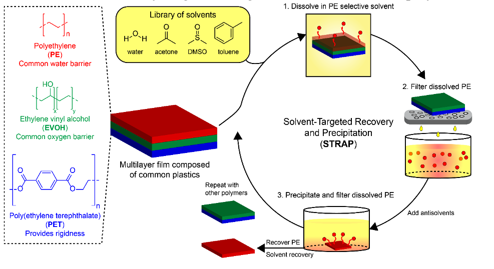
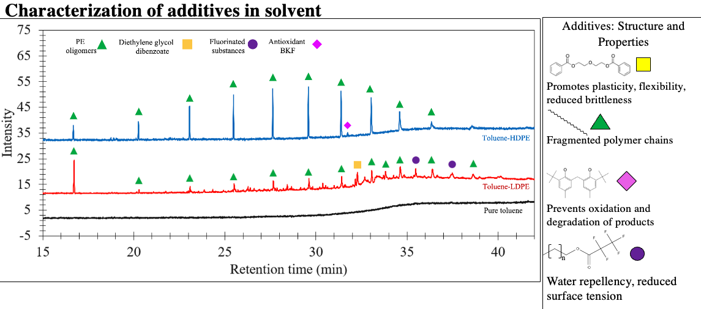
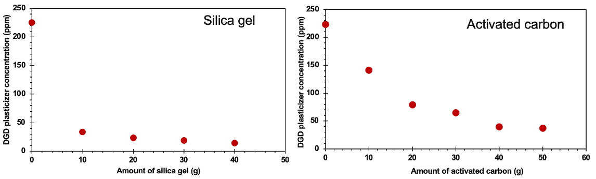
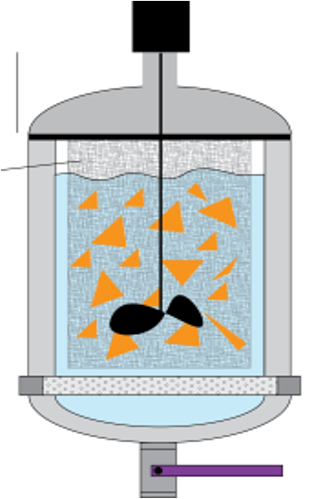
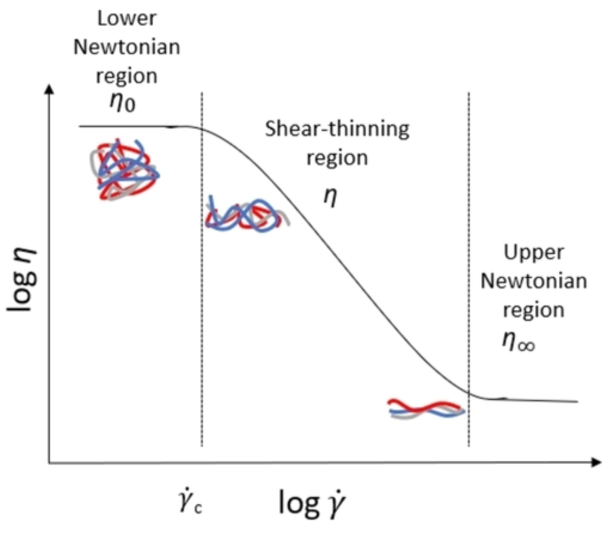
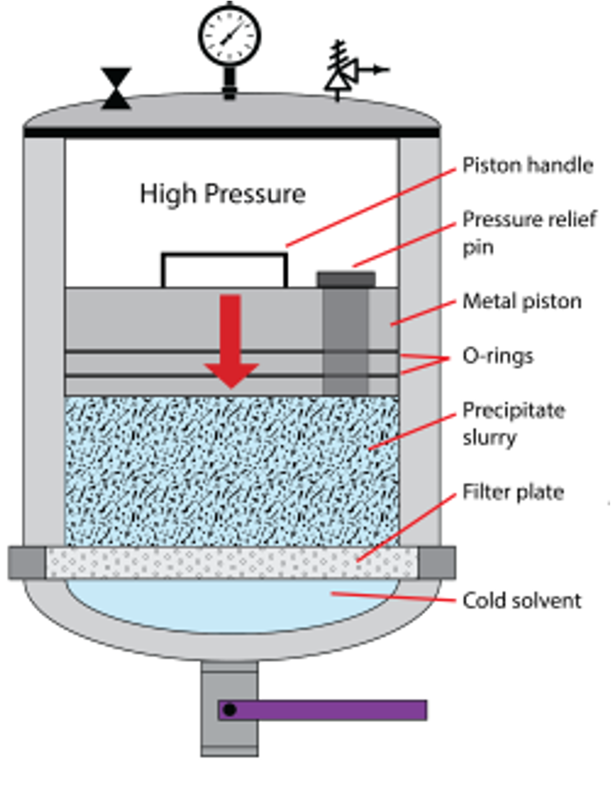

# STRAP: Solvent-Targeted Recovery and Precipitation {: .text-center data-aos="fade-down" }

**Period:** Mar 2022 – May 2024
{: .text-center data-aos="fade-down" }

**Affiliation:** UW-Madison Department of Chemical & Biological Engineering (Huber Group)
{: .text-center data-aos="fade-down" }

## The Challenge: Recycling Complex Plastics {: .text-center}
Modern life relies heavily on plastics, especially multilayer films prized for their ability to preserve food and protect products. However, their complex, layered structure makes them notoriously difficult to recycle using conventional mechanical methods, which typically shred and melt plastics. This difficulty is a major reason why global plastic recycling rates remain strikingly low (historically under 9%), leading to vast amounts of plastic waste in landfills and ecosystems.   

## Our Solution: The STRAP Process {: .text-center}
The Solvent-Targeted Recovery and Precipitation (STRAP) process, developed to tackle this specific challenge, offers a sophisticated chemical recycling approach. STRAP works by systematically dissolving individual polymer layers from these films and then selectively precipitating them out as purified resins. 

{: .centered-image style="max-width: 600px;" data-aos="zoom-in" } 

The general STRAP methodology involves:  
- Mixing polymer films with a solvent chosen for its ability to selectively dissolve a target polymer.  
- Heating and stirring the mixture to ensure complete dissolution of the target polymer.  
- Separating undissolved layers, then cooling the polymer-rich solution to allow the target polymer to precipitate.  
- Filtering to separate the purified, precipitated polymer from the solvent.  

## My Journey with STRAP: Optimization, Sustainability, and Innovation {: .text-center}
My contributions to the STRAP initiative spanned several crucial phases over two years, focusing on refining the core process, enhancing its environmental and economic viability through solvent recycling, and finally, contributing to next-generation equipment design for improved efficiency and scale-up.

### Mastering and Optimizing Core STRAP {: .text-center}
My initial year and a half was dedicated to deeply understanding and optimizing the fundamental STRAP parameters involving:  
- Systematically testing variables such as solvent choice, dissolution temperatures, and processing times to maximize polymer recovery.  
- Working to improve the purity of the recovered polymers.  
This led to **94% recovery** of targeted polymers like PE, EVOH, and PET.

### Enhancing Sustainability: Solvent Regeneration {: .text-center}
A critical aspect for the long-term feasibility of any solvent-based process is the ability to reuse solvents effectively. Over multiple STRAP cycles, solvents become contaminated with plastic additives (e.g., plasticizers like Diethylene Glycol Dibenzoate - DGD, and inks), which diminishes their dissolution capacity.

{: .centered-image style="max-width: 600px;" data-aos="zoom-in" }

My research extensively investigated methods to purify these contaminated solvents. Through comparative testing of various adsorbents:
*   I found that **silica gel** was exceptionally effective. Adding silica gel at a ratio of just 10% to the weight of the processed plastic led to an **85% reduction in DGD plasticizer concentration** in the solvent via adsorption.
*   This simple yet effective adsorption step demonstrated a viable path for regenerating solvents, significantly reducing waste and operational costs, thereby improving the overall sustainability of STRAP.

{: .centered-image style="max-width: 600px;" data-aos="zoom-in" } 
<!-- Caption: This figure shows an ~85% reduction of Diethylene Glycol Dibenzoate (DGD) concentration in solvent using only 10g (10% of sample mass) of silica gel. The reduction tapers off past 10g, which shows that with roughly 10g of silica gel in a 100g solvent sample, we can clean the solvent to a point of reuse. --> 
<!-- This caption is good, can be placed under the image in Markdown -->

This figure shows an ~85% reduction of Diethylene Glycol Dibenzoate (DGD) concentration in solvent using only 10g (10% of sample mass) of silica gel. The reduction tapers off past 10g, indicating an optimal loading for efficient solvent cleaning.

### Advancing the Technology: Custom Equipment & Process Insights {: .text-center}
Building on the optimized core process, my later work involved contributing to the design, implementation, and testing of a specialized, closed-system vessel aimed at improving efficiency and gathering data for pilot-scale considerations.

**1. Integrated Mixing & Viscosity Monitoring:**
The custom vessel (up to 3L capacity) featured an integrated mixer that also allowed for real-time torque measurements. This was significant because:
*   Torque served as a proxy for solution viscosity, enabling us to monitor the dissolution of polyethylene. We observed characteristic shear-thinning behavior, where viscosity (and thus torque) decreased as the polymer dissolved and the mixture approached homogeneity around 140°C.
*   This data allowed for optimizing mixing speed and temperature for complete dissolution.

{: .centered-image style="max-width: 200px;" data-aos="zoom-in" } 
{: .centered-image style="max-width: 300px;" data-aos="zoom-in" }

**2. Pressurized Piston System for Enhanced Solvent Extraction:**
A key innovation was a pressurized piston system (up to 100 psi) integrated into the vessel.
*   This system mechanically compressed the precipitated polymer cake, forcing out significantly more residual solvent than traditional vacuum filtration alone.
*   This resulted in a drier, purer polymer cake and improved solvent recovery rates.

{: .centered-image style="max-width: 300px;" data-aos="zoom-in" }

**3. Data Collection & Thermodynamic Analysis:**
Systematic trials with this vessel involved meticulous logging of parameters like pressure, time, and yields. This data was vital for optimizing the new system's operation. Furthermore, we analyzed the thermodynamics of precipitation, using  
 Q = m * Cp_weighted * ΔT
 to calculate the heat removal required for controlled polymer precipitation (e.g., a loss of ~114,426 Joules for a specific sample to precipitate from 140°C to 85°C), informing the design of cooling systems for scale-up.

## Key Achievements Summary {: .text-center}
*   Optimized core STRAP parameters, achieving up to **94% polymer yield**.
*   Developed and validated an effective solvent regeneration method using silica gel, achieving **85% removal of DGD plasticizer** and enabling sustainable solvent reuse.
*   Contributed to the design, construction, and successful testing of an advanced STRAP vessel with integrated mixing/viscosity monitoring and a pressurized piston system.
*   Utilized real-time torque/viscosity data to optimize polymer dissolution.
*   Demonstrated improved solvent extraction and polymer purity with the pressurized piston.
*   Collected critical process data from vessel trials and performed thermodynamic calculations for precipitation, aiding scale-up efforts.
*   Collaborated to increase STRAP batch processing capacity by **500%**.
*   Produced **1 kg of recycled polyethylene** for successful pilot film manufacturing.
*   Employed GC-MS for analytical characterization of solvents and contaminants.

## Challenges {: .text-center}
The STRAP journey involved tackling challenges from fundamental process optimization and effective polymer separation (especially with contaminated films) to innovative equipment design and detailed process analysis. Key learnings included the critical importance of solvent purity, the insights gained from real-time process monitoring like viscosity, and the complexities of scaling chemical processes. The meticulous data collection from various experimental phases, including the piston vessel trials, underscored the power of quantitative analysis in refining and advancing such technologies.

While deeply rooted in chemical engineering, this multi-faceted project significantly honed my skills in experimental design, data collection, quantitative analysis, and problem-solving—all core competencies directly transferable and highly valuable in the field of data science.